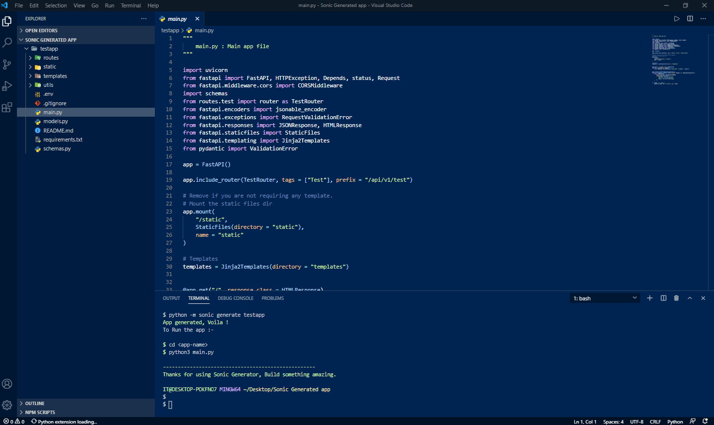
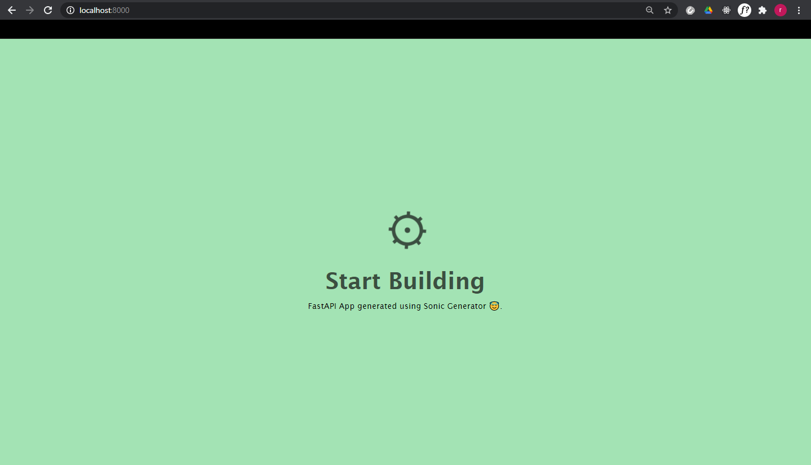

# Sonic Generator

A CLI app for automatically generating a starter template for your FastAPI projects in a jiffy.

| Latest Release |  [](https://pypi.org/project/sonic-generator/) |
| :--- | :--- |
| Release Status |  [](./) |
| License |  [](./) |

# Installation

### Using pip

```bash
  $ pip install sonic-generator
```
## Installing manually

```bash
  $ git clone https://github.com/rexsimiloluwah/sonic-generator
  $ cd sonic-generator
  $ python setup.py install
```
# Usage

```bash
$ python -m sonic generate <app-name>
```


## Testing

```bash
$ cd <app-name>
```

```bash
$ python main.py
```

Go to http://localhost:8000 in your browser



Edit the files and quickly build your FastAPI project.

## Contributing Guide 

All contributions are welcome to add more features and fix bugs, Contribution guide coming soon.

### Thanks for using Sonic generator folk !
